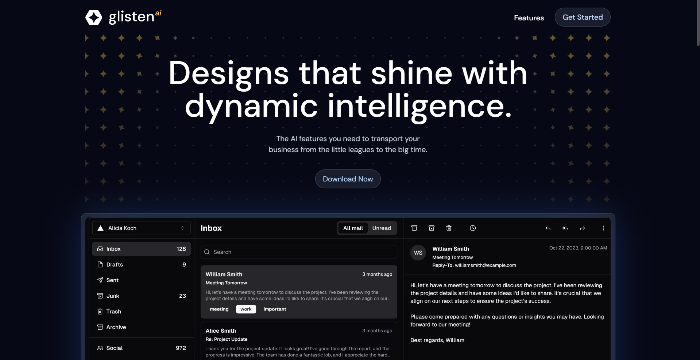

# Glisten AI - A Dark Modern Animated Website

This project is a sleek, dark, and modern website built with Next.js 14, GSAP, Prismic, Tailwind, and TypeScript. It's styled in the same vein as Linear, AuthKit, Raycast, Clerk, and many more!

<a href="https://glisten-ai-dark.vercel.app/" target="_blank" rel="noreferrer"> 
  k 
</a>

## Tools Used

- **Next.js**: The leading React framework that enables features such as server-side rendering and generating static websites.
- **Prismic**: A headless CMS that provides a page builder. This project uses Prismic to manage the website content.
- **GSAP**: A robust JavaScript animation library. This project uses GSAP to add wonderful animations to the site, both on page load and on scroll.
- **Tailwind CSS**: A utility-first CSS framework. This project uses Tailwind CSS for styling.

## Usage

To run the website locally, follow these steps:

1. Clone the repository
2. Install the dependencies with `npm install`
3. Start the development server with `npm run dev`
4. Link your project with Prismic to add/update the content

## Contributing

While this is a personal group project, we are open to collaboration. If you have suggestions for improvements, please open an issue.

## License

This project is licensed under the MIT License - see the [LICENSE](LICENSE) file for details.

 
